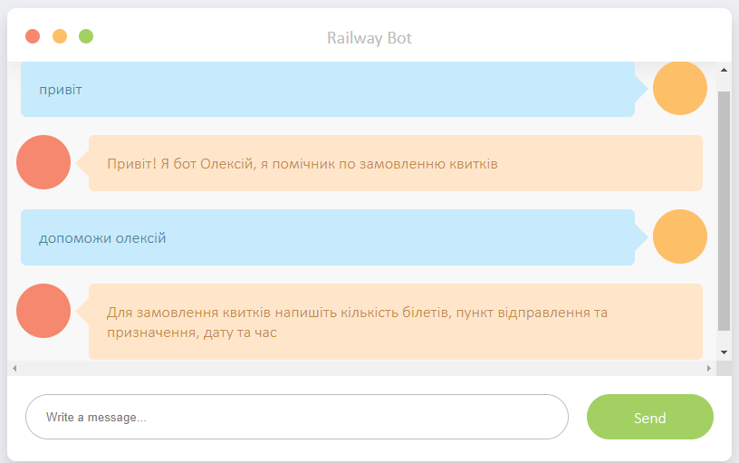
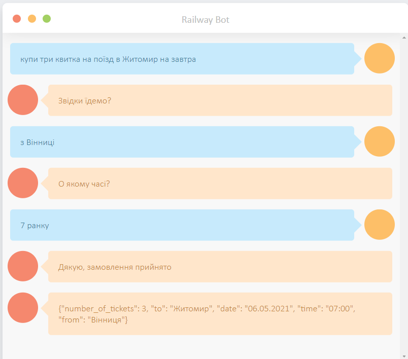

# **Rasa Railway Tickets Bot**

Foobar is a Python library for dealing with word pluralization.

## Installation

### Using Docker:

```bash
cd rasa
docker-compose up
```
After deploying four containers:
* Rasa(localhost:5005)
* Rasa Action Server(localhost:5055)
* DucklingHTTPExtractor(localhost:8000)
* Flask Web API(localhost:8080), which serves html page and routes requests to Rasa bot.

### Without Docker(almost):
Installing dependencies:
```
pip3 install -r requirements.txt
```
Launching bot and flask wrapper:
```
cd rasa_test/rasa
rasa run --enable-api
rasa run actions
docker run -p 8000:8000 rasa/duckling
cd rasa_test/app
python3 -m flask run --host=0.0.0.0 --port=8080
```
    
## Usage

Use [localhost:8080]() to access bot. 

Bot classifies your messages in four possible intents:


Greet:
> *Good evening, London*       

Examples:
- Привіт
- хай
- доброго дня

Help:
> *DOORSTUCK, DOORSTUCK*       

Examples:
- хелп
- допомога
- допоможи

Booking:
> *I'll have two number 9s, a number 9 large*       

> Ви: Хочу замовити два квитки в Харків на завтра 
> Олексій: Звідки їдемо?    
> Ви: Полтава   
> Олексій: О якому часі виїзжаємо?   
> Ви: 6 вечора  
> Олексій: Дякую за замовлення!     
> Олексій: {"number_of_tickets": 2, "date": "06.05.2021", "time": "18:00", "to": "Харків",
"from": Полтава}

Examples:
- Хочу замовити два квитки в Харків  
- Хочу замовити 2 білета в Одесу 20 червня на 16:30
- квитки на поїзд Київ-Дніпро

NRE may not recognize correct entity role, just reload the page and try another request.

Out of context:
> *I understand your attempts at humor. I just don't find them entertaining.*       

Examples:
- квитки на літак
- чого не приїхав поїзд
- коли буде поїзд
- чи варто чекати поїзд
- дякую укрзалізниця

### Conversation examples:
 Help and greeting extraction

 Booking extraction
